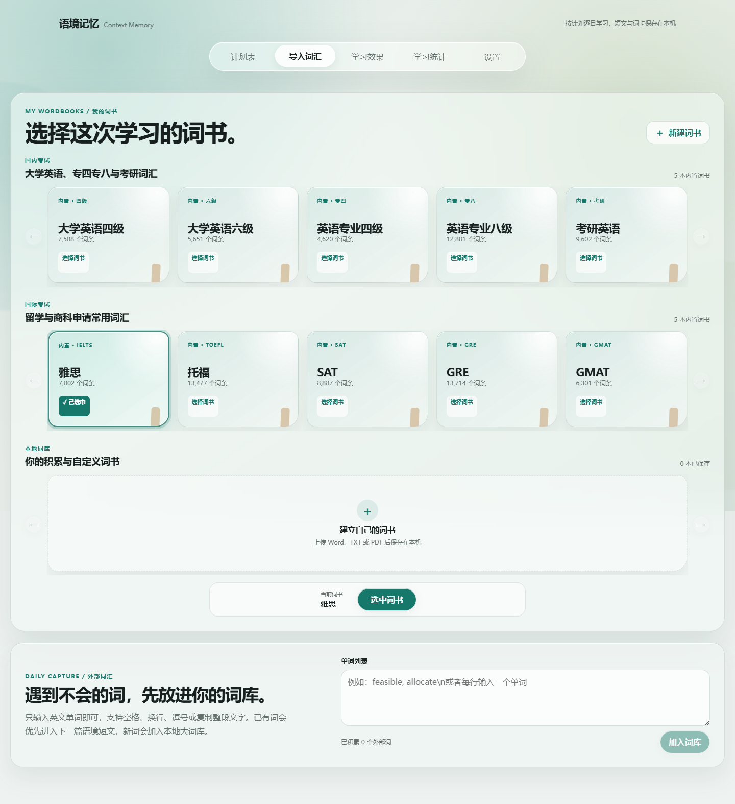
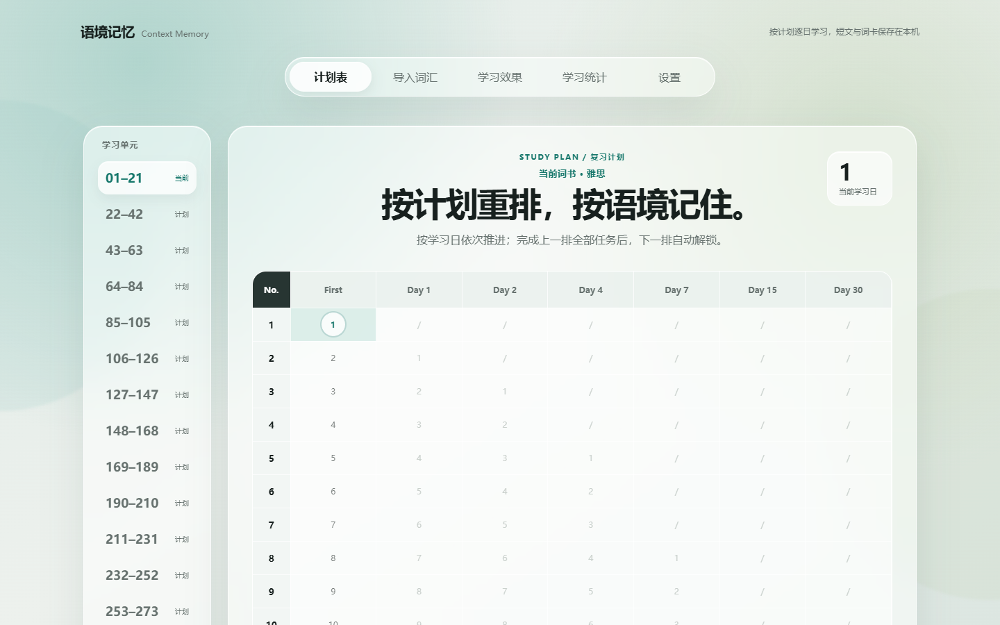
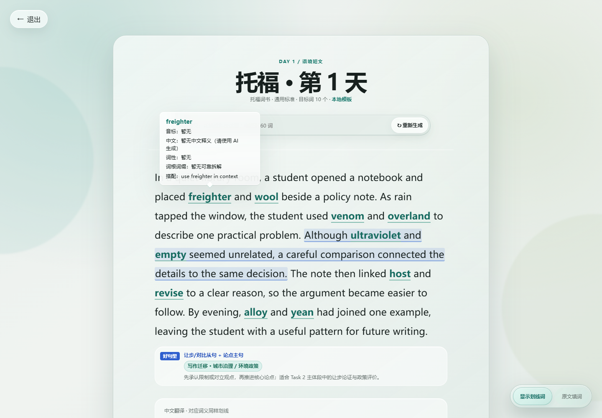
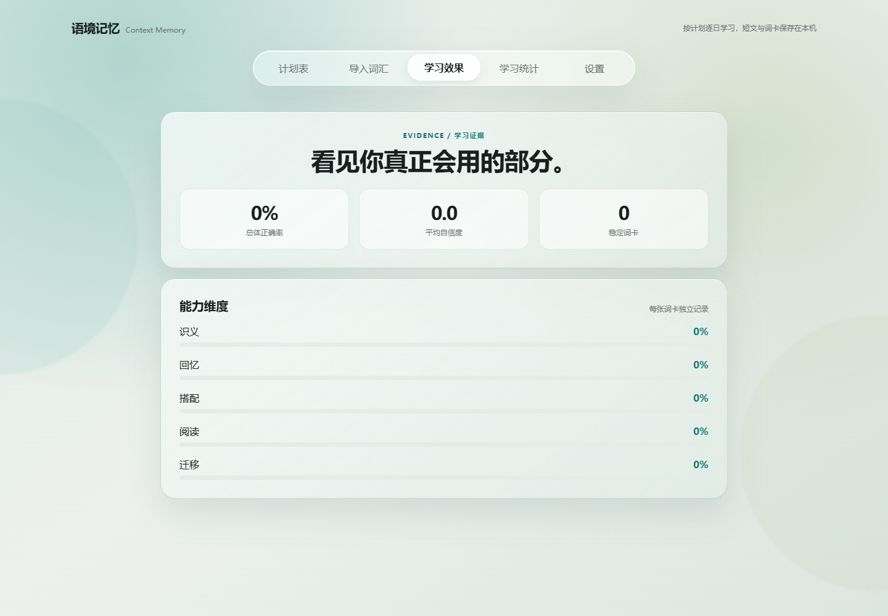
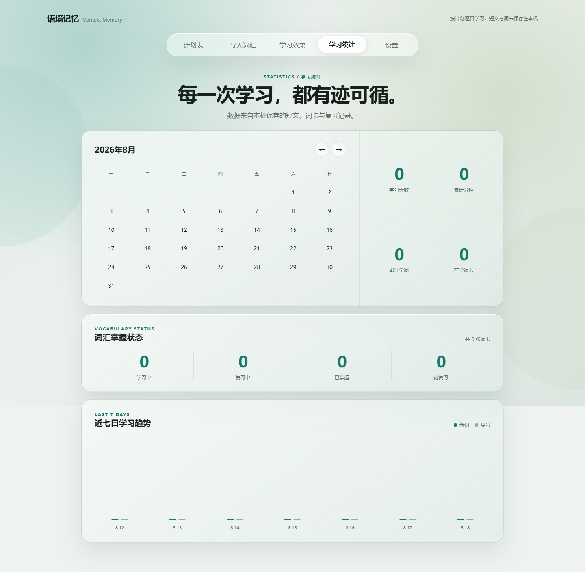
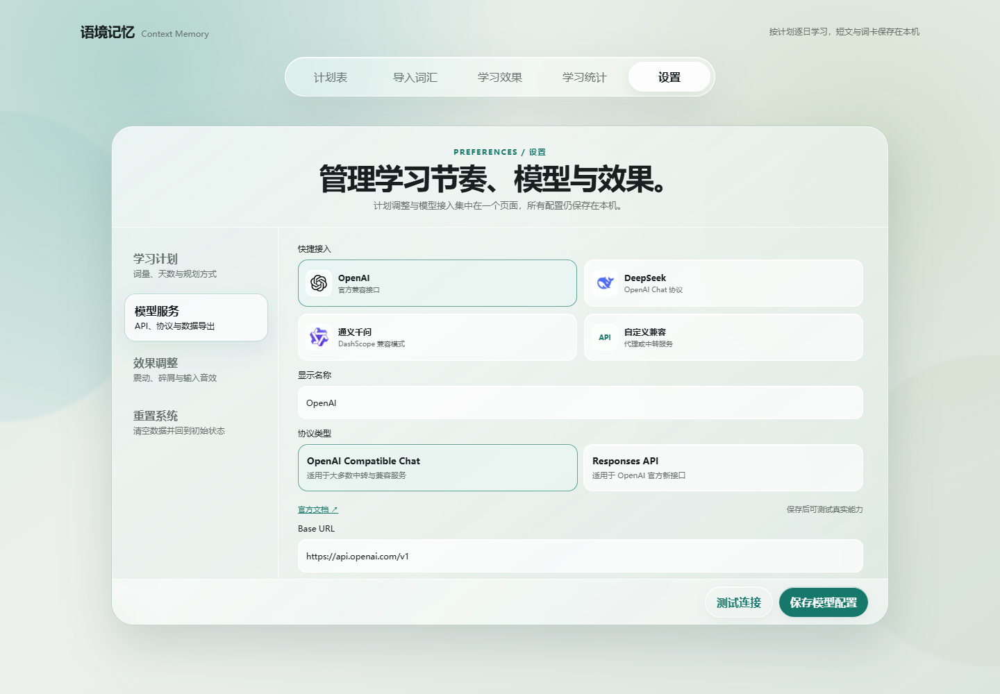

# 语境记忆 · Context Memory

[](https://github.com/XPHnscj/word-world)
[](https://nodejs.org/)
[](https://nextjs.org/)
[](https://www.typescriptlang.org/)
[](./LICENSE)

<p align="center">
  
</p>

> 你是否已经厌倦了“单独划卡、看释义、再划下一张”的背词机制？
>
> 语境记忆把词条放回短文、搭配和主动回忆里，让“背过一个词”逐步变成“能在新语境中调用它”。

语境记忆是一款本地优先的英语词汇学习工具。它不把学习拆成孤立的单词卡，而是把词书、具体场景、短文阅读、原文填词、主动回忆和间隔复习串成一条完整路径。

你可以选择考试词书、导入自己的词表，或从日常阅读中积累词汇；系统会为目标词组织短文，记录你真正想起了什么，并把下一次复习安排到计划表里。

## 为什么不是又一个单词产品？

许多背词产品的核心单位是“单词 → 释义 → 打卡”。语境记忆把核心单位换成了：

```text
词条 + 真实场景 + 搭配/句型 + 主动回忆 + 可追踪的复习证据
```

它更像一个可迁移的语言训练场：

| 常见背词方式 | 语境记忆 |
| --- | --- |
| 一次只看一个词 | 一组词被放进同一篇可理解的短文 |
| 主要依赖认识中文 | 先读懂语境，再主动补回原词 |
| 完成次数等于学会 | 记录识义、拼写、搭配、迁移等不同能力 |
| 词书是静态列表 | 词书是可选择、可导入、可持续积累的学习源 |
| 数据依赖账号和云端 | 数据默认保存在项目本机，可导出、可备份 |
| AI 是唯一入口 | AI 增强体验；没有模型配置也能使用本地模板 |

## 界面导览

### 1. 词书架：先选择你这次要学什么



词书页把现成内容和个人积累放在同一张“书架”上：

- 国内考试与国际考试词书分组展示，减少长列表中的寻找成本。
- 点击整张卡片即可选中，绿色边框、状态标签和底部当前词书同时变化。
- 选中的词书会成为计划表、短文生成、统计和复习进度的共同数据源。
- 支持创建自定义词书，也支持 TXT、CSV、Markdown、Word、PDF 等格式导入。
- 底部的外部词汇入口适合把临时遇到的词先收进自己的词库。

### 2. 计划表：把新词和复习节点放进一个时间网格



计划表不是简单的打卡日历：

- 左侧按学习单元切换长计划，适合几百天的词书逐段推进。
- 横向列出 First、Day 1、Day 2、Day 4、Day 7、Day 15、Day 30 等复习节点。
- 每个格子都对应一个明确的学习任务，点击即可进入当天短文。
- 当前学习日、已完成任务、未解锁任务有不同的视觉状态。
- 计划参数按当前词书保存，不会因为切换另一套词书而混用进度。

### 3. 阅读短文：在语境里提取，而不是只看答案



阅读页是整个学习闭环的中心：

- 目标词直接嵌入短文，点击可以查看词义和搭配。
- “显示划线词 / 原文填词”可以在理解与主动回忆之间切换。
- 原文填词完成后，系统再记录学习日，而不是打开文章就算完成。
- 文章底部展示值得模仿的关键句型，帮助把词汇迁移到自己的表达里。
- 调整意见可以要求更换主题、场景或篇幅；模型不可用时自动回退到本地模板。

### 4. 学习效果：看见真正会用的能力



学习效果页不只显示一个总分，而是拆开记录：

- 识义、回忆、搭配、阅读、迁移五个能力维度。
- 总体正确率、平均自信度和稳定词卡数量。
- 每个词的学习证据独立累积，避免一次猜对就被误判为完全掌握。

### 5. 学习统计：把学习过程留下来



统计页把学习过程变成可回看的记录：

- 日历查看哪些日期真正完成了学习。
- 学习天数、累计分钟、累计学习词数和在学词卡。
- 学习中、复习中、已掌握、待复习四种词卡状态。
- 最近七日新词与复习趋势，帮助判断计划是否需要调整。

### 6. 模型设置：接入 AI，也保留本地控制权



设置页把计划、模型、效果和重置放在同一处：

- 可选 OpenAI、DeepSeek、通义千问或自定义兼容服务。
- 支持 OpenAI Compatible Chat 与 Responses API。
- 可以设置每日新词、目标天数、短文规划方式和输入反馈效果。
- “测试连接”使用轻量探针，不会因为生成整篇文章太慢而误判服务故障。

### 7. 模型服务：可选的增强层，不是使用门槛

设置页支持 OpenAI、DeepSeek、通义千问和大多数 OpenAI 兼容接口。AI 可用于生成更自然的短文、中文翻译、逐词释义、搭配和句型说明。

项目有三层保护：

1. 生成前校验目标词覆盖、重复、篇幅和翻译定位。
2. 生成失败时回退到本地模板，学习流程不会被网络或模型服务卡死。
3. API Key 默认只保存在当前浏览器标签的 `sessionStorage`；服务端配置使用 `.env.local`，不会写入学习数据库。

## 功能清单

- 内置多套国内考试、国际考试和商科申请词书。
- 自定义词书：手动创建、粘贴文本、上传文件、自动去重。
- 语境短文：目标词自然分散在 4–6 句短文中，避免逗号堆词。
- 中文翻译与逐词定位：词条翻译必须来自当前文章的当前译文。
- 原文填词：在真实句子中完成首次主动回忆。
- 五类学习任务：识义、阅读、搭配、迁移和句子生成。
- 间隔复习：按学习记录计算后续复习节点，而不是只累计连续天数。
- 学习统计：正确率、词卡状态、学习证据和复习进度可追踪。
- 数据导出：词卡、短文、复习记录、自定义词书和计划都可导出 JSON。
- 本地回退：不配置模型也能浏览词书、生成模板短文和完成基础练习。
- 固定本地地址：统一使用 `http://127.0.0.1:3000`，避免浏览器 origin 变化造成数据分裂。

## 快速开始

### 环境要求

- Node.js 20+
- Windows、macOS 或 Linux
- AI 服务不是必需项；没有 API Key 也可以使用本地模式

### 安装与启动

```bash
git clone https://github.com/XPHnscj/word-world.git
cd word-world
npm install
npm run dev
```

打开 [http://127.0.0.1:3000](http://127.0.0.1:3000)。Windows 用户也可以运行项目根目录的 `launch.ps1`。

### 配置模型服务（可选）

复制 `.env.example` 为 `.env.local`，填写任意 OpenAI 兼容接口：

```dotenv
IELTS_AI_API_KEY=your_key
IELTS_AI_BASE_URL=https://api.deepseek.com
IELTS_AI_MODEL=deepseek-chat
```

`IELTS_AI_*` 是项目早期版本留下的兼容环境变量名，不代表产品定位；设置页和 README 的产品品牌统一为“语境记忆”。也可以只在设置页临时填写模型服务。

开发环境允许使用本机 HTTP 代理，例如 `http://127.0.0.1:11434/v1`；生产环境的自定义服务地址应使用公开 HTTPS。

## 常用命令

| 命令 | 作用 |
| --- | --- |
| `npm run dev` | 启动本地开发服务 |
| `npm run build` | 构建生产版本 |
| `npm run start` | 启动生产服务 |
| `npm test` | 运行 Vitest 测试 |
| `npm run lint` | 运行 ESLint |

提交改动前建议执行：

```bash
npm test -- --run
npm run lint
npm run build
```

## 数据与隐私

语境记忆坚持“本地优先、可迁移、不强制云服务”：

- 学习数据权威副本保存在项目目录的 `data/learning.sqlite`。
- 浏览器 IndexedDB 作为前端缓存和旧数据迁移来源。
- API Key 不写入 SQLite，也不会进入导出的学习数据 JSON。
- 项目不包含账号系统、订阅、遥测或第三方分析脚本。
- AI 生成和图片 OCR 会把相应词表内容发送到你配置的模型服务；未配置 AI 时使用本地模式。
- 建议通过“设置 → 导出学习数据”定期备份，也可以备份 `data/learning.sqlite`。

## 技术结构

```text
src/app/page.tsx                         主界面、词书切换与学习流程
src/app/components/TodayView.tsx         计划表与复习网格
src/app/api/context-packs/generate       AI/本地短文生成接口
src/app/api/context-packs/extract        TXT/CSV/Word/PDF/图片提取接口
src/app/api/storage                      SQLite 快照读写接口
src/lib/db.ts                            浏览器缓存与学习数据访问
src/lib/serverStore.ts                   本地 SQLite 持久化
src/lib/contextPack.ts                   AI 回复解析、校验与词卡打包
src/lib/provider.ts                      模型地址安全策略
wordbooks/                               内置词书数据
docs/screenshots/                        README 功能截图
```

技术选择的重点不是堆叠服务，而是让单机学习工具长期可靠：Next.js + TypeScript 提供界面与接口，SQLite 提供可备份的本地权威存储，IndexedDB 保证浏览器端交互顺滑，Vitest 覆盖词库、复习、解析和持久化逻辑。

## 开源路线图

- [x] 词书分类与词书选择
- [x] 自定义词书和文件导入
- [x] 语境短文、本地回退与模型接入
- [x] 原文填词与间隔复习计划
- [x] SQLite 持久化与 JSON 导出
- [ ] 更细的复习数据可视化
- [ ] 可导入/导出的计划模板
- [ ] 更多语言与词书格式适配
- [ ] 社区词书贡献规范

## 参与贡献

欢迎提交 Issue、改进建议和 Pull Request。

建议：

1. 先说明用户场景和可复现步骤。
2. 算法或数据结构改动请补充测试。
3. UI 改动同时检查约 1440px 桌面宽度和 800px 以下窄屏。
4. 不要提交 `.env.local`、API Key、`data/learning.sqlite` 或个人学习数据。

## License

[MIT](./LICENSE)
