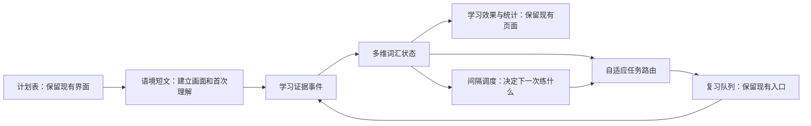

# 雅思语境记忆：学习系统改造计划

## 1. 改造目标

本次改造不推翻现有产品形态，不重新设计页面，不改变用户已经熟悉的学习路径。现有液态玻璃视觉、顶部导航、计划表、语境短文阅读页、右下角悬浮操作栏、复习队列、学习效果、学习统计和设置页面全部保留。

改造重点是把当前“Lv0 初见 → Lv4 融入”的单线等级，升级为“多维词汇掌握状态 + 学习证据 + 自适应任务路由”。计划表继续负责告诉用户今天学什么，语境短文继续负责建立记忆画面，复习队列负责根据个人薄弱项选择下一种练习。

最终目标不是让用户完成更多题，而是让系统能够回答三个问题：

1. 用户对这个词究竟会到什么程度？
2. 当前最值得练的是词义、拼写、搭配、造句还是迁移？
3. 系统凭什么判断这个词已经真正掌握？

## 2. 理论依据

### 2.1 多维词汇知识

参考 Paul Nation 的词汇知识框架，将词汇掌握拆分为词形、词义和使用，并区分接受性知识与产出性知识。一个词不再只拥有一个等级，而是拥有多项独立能力状态。

参考资料：

- [Learning Vocabulary in Another Language](https://www.wgtn.ac.nz/lals/resources/vocrefs/contents)
- [The Four Strands](https://openaccess.wgtn.ac.nz/articles/journal_contribution/The_four_strands/12552167)

### 2.2 提取练习与间隔学习

复习不只判断“看见后认识”，还要区分接受性提取和产出性提取。主动拼写、主动造句和主动选择搭配分别提供不同的掌握证据。复习时间由每项能力的稳定度决定，不再完全依赖固定天数。

参考资料：

- [Receptive and Productive Word Retrieval Practice](https://www.jstage.jst.go.jp/article/katejournal/30/0/30_11/_article)
- [A Trainable Spaced Repetition Model for Language Learning](https://research.duolingo.com/papers/settles.acl16.pdf)

### 2.3 高参与度任务

参考 Involvement Load Hypothesis，将任务设计为 Need、Search、Evaluation 三种认知投入。系统不仅让用户填空，还要求用户检索、比较、判断和使用目标词。

参考资料：

- [Some Empirical Evidence for the Involvement Load Hypothesis](https://onlinelibrary.wiley.com/doi/10.1111/0023-8333.00164)

### 2.4 证据中心设计与动态评估

参考 Evidence-Centered Design：先定义要证明的能力，再选择能产生相应证据的任务。参考动态评估理念，系统使用逐级提示，而不是第一次出错便直接展示答案。

参考资料：

- [ETS Evidence-Centered Language Assessment](https://www.ets.org/research/policy_research_reports/publications/report/2019/kaaz.html)
- [ACTFL Can-Do Statements](https://www.actfl.org/educator-resources/ncssfl-actfl-can-do-statements)

### 2.5 词块与写作迁移

词汇学习单位从单个单词扩展为“单词 + 搭配 + 句型框架 + 修辞功能”。学习 `evidence` 时不仅记住中文，还要掌握 `provide evidence for`、`compelling evidence`、`there is growing evidence that...` 以及它们在 IELTS 写作中的论证功能。

## 3. 不可破坏的现有功能与界面

以下内容属于本次改造边界，实施时不得随意调整：

1. 顶部导航的页面数量、顺序和液态玻璃设计保持不变。
2. 计划表继续使用 First、Day 1、Day 2、Day 4、Day 7、Day 15、Day 30 列。
3. 计划表仍按时间顺序解锁；上一排未完成时，下一排不能进入。
4. 计划表单元格继续只展示数字、当前状态或完成勾选，不塞入复杂能力数据。
5. 阅读页的学习日、标题、主题信息和调整意见框继续沿页面中轴居中。
6. 阅读正文继续保持独立的居中阅读宽度。
7. “显示划线词 / 原文填词 / 检查 / 记录学习日”继续固定在右下角。
8. 中文翻译继续与英文目标词逐词对应并划线。
9. 音标、中文义、词性、词根词缀和搭配继续作为目标词注释内容。
10. 自定义词书、内置词书、文章、词卡和复习记录继续保存在项目 SQLite 中。
11. AI 不可用时，基础学习、拼写检测、计划推进和本地复习仍然能够运行。
12. 键盘音效、震动与粒子效果仍属于可选反馈，不参与掌握度评分。

## 4. 新系统总体结构



### 4.1 两套进度必须分开

- 计划进度：表示某一天安排的学习任务是否完成，用于计划表数字、解锁和勾选。
- 词汇掌握度：表示某个词在不同能力上的真实表现，用于复习路由和学习效果。

完成 Day 30 任务后，计划表单元格可以显示完成勾选，但这不意味着所有相关词汇永久掌握。后续发生遗忘时，单词仍可进入独立复习队列，不破坏已经完成的计划表。

## 5. 多维词汇状态模型

每张词卡增加以下能力维度：

| 维度 | 含义 | 主要证据 |
|---|---|---|
| `formRecognition` | 看见或听见后能否识别词形 | 识别题、听音选词 |
| `meaningRecall` | 能否主动回忆核心词义 | 英文释义判断、中文回忆 |
| `spelling` | 能否脱离原文正确拼写 | 原文填词、听写 |
| `collocation` | 能否使用自然搭配 | 搭配选择、搭配补全 |
| `grammarUse` | 能否使用正确词性和语法形式 | 词形变化、句子纠错 |
| `production` | 能否在指定情境中主动造句 | 控制造句、观点表达 |
| `transfer` | 能否跨语境保持含义和用法 | 新场景造句、语义判断 |
| `fluency` | 能否快速且稳定地调用 | 限时回忆、反应时间 |

每个维度至少保存：

- 当前掌握概率或强度；
- 记忆稳定天数；
- 难度；
- 下次到期时间；
- 有效证据数量；
- 最近一次成功时间；
- 最近一次无提示成功时间。

用户主界面不直接显示复杂概率。界面继续使用“正在建立 / 可以回忆 / 可以调用 / 跨场景稳定”等容易理解的状态；这些状态由多维数据计算得出，不再反过来控制学习逻辑。

## 6. 学习证据模型

每次有意义的操作保存为一条学习证据，不再只保存“对或错”。

建议字段：

```text
cardId
dimension
taskType
correct
score
confidence
hintLevel
elapsedMs
answer
contextId
contextTopic
evaluator
createdAt
```

评分原则：

1. 无提示、快速、正确的主动提取，证据权重最高。
2. 使用提示后答对，记录为部分掌握，不等同于独立答对。
3. “认识 / 模糊 / 忘记”作为主观信心证据，不能代替客观任务结果。
4. 自信但答错时，记录为“信心校准风险”，后续优先安排短间隔复习。
5. 只见过一次或只在同一篇文章中答对，不能判定为迁移掌握。
6. AI 评分只负责自然度、语义和搭配判断；拼写、选择题和时间数据由本地确定。

## 7. 固定计划表中的学习路径

现有艾宾浩斯计划表继续保留，但每一列负责收集不同的学习证据。

| 节点 | 主要目标 | 默认任务 | 语境策略 |
|---|---|---|---|
| First | 建立场景、理解词义、注意词形 | 阅读、词义注释、首次原文填词 | 使用原始语境 |
| Day 1 | 巩固词形与拼写 | 原文填词、首字母提示 | 保持原始语境 |
| Day 2 | 语义确认 | 英文释义 + 认识/模糊/忘记 | 保持相似语境 |
| Day 4 | 搭配和语法使用 | 搭配补全、词形选择、句子纠错 | 保持相似话题 |
| Day 7 | 主动调用 | 根据提示写完整句子 | 允许受控新语境 |
| Day 15 | 迁移使用 | 换场景造句、表达观点 | 使用明确的新场景 |
| Day 30 | 综合与流利度 | 限时调用、短写作、综合判断 | 跨话题或写作语境 |

语境变化不能过早。词义和拼写尚未稳定时优先重复原场景；只有基础能力达到阈值后，才进入摄影、商业、教育、科技、公共服务等迁移场景。

## 8. 四股学习在现有页面中的落点

不新增一级导航，只在现有页面内部完成四种学习活动：

| Four Strands | 项目中的落点 |
|---|---|
| 意义输入 | 语境短文、中文翻译、阅读理解、可选朗读 |
| 意义输出 | 复习队列中的造句、观点表达、短写作 |
| 语言聚焦 | 拼写、音标、词性、词根词缀、搭配和句型讲解 |
| 流利度发展 | 已学词限时回忆、快速填词、熟词短表达 |

每天不要求四类任务平均出现，而是在一个滚动周期内保持大致平衡。新手阶段可以增加语言聚焦，中后期逐步提高输出和流利度任务比例。

## 9. 自适应任务路由

复习队列不再简单根据 `masteryLevel` 决定阶段，而是从到期词中选择“当前最有价值的任务”。

### 9.1 路由输入

- 每个能力维度的掌握度与稳定度；
- 距离上次练习的时间；
- 最近错误与模糊次数；
- 是否依赖提示；
- 反应时间；
- 信心与实际表现是否一致；
- 已成功使用过的语境数量；
- 今日学习时间预算和任务数量预算。

### 9.2 基本路由规则

```text
会认但不会拼        → 拼写提取
会拼但词义模糊      → 英文释义与语义辨析
词义稳定但搭配弱    → 搭配补全或纠错
搭配稳定但不会调用  → 控制造句
同一语境中会使用    → 延迟后进行新语境迁移
所有维度稳定但太慢  → 限时流利度任务
自信度高但频繁答错  → 降低提示并缩短复习间隔
```

任务路由必须可解释。复习页可用一行小字说明“本次练习原因”，例如“你已经能识别这个词，但最近两次拼写仍需要提示”。

## 10. 动态提示阶梯

提示按层级逐步出现，用户主动请求后才展开下一层：

```text
0 无提示
1 显示词性或句法位置
2 显示首字母或词长
3 显示词根词缀或核心搭配
4 显示英文释义
5 显示完整答案
```

提示层级必须进入学习证据。使用完整答案完成任务只代表“完成当前练习”，不能提高主动提取能力。

## 11. 词块与 IELTS 写作能力

每个目标词在保留现有字段的基础上，逐步增加：

- `phraseFrames`：可替换的高频表达框架；
- `rhetoricalFunctions`：举例、让步、因果、论证、评价、趋势描述等；
- `register`：正式、一般、口语或学术语域；
- `acceptedForms`：常用词形变化；
- `contrastWords`：容易混淆的近义词；
- `exampleContexts`：已经学习过的语境标签。

文章中的“好句型”继续只展示一次。复习任务可以引用该句型框架，但不能在中文翻译下面重复完整讲解。

AI 生成内容必须继续满足现有约束：

1. 短文约 75–95 词、4–6 句，明显超过 110 词才要求重写。
2. 目标词不能连续罗列，同一篇中原则上只出现一次。
3. 场景必须有地点、人物动作和可感知细节。
4. 中文翻译必须属于当前英文短文。
5. `translationZh` 必须能在全文翻译中逐字定位。
6. 写作话题必须来自句子的真实修辞用途，不能根据故事地点臆测。

## 12. 数据与持久化改造

当前 `data/learning.sqlite` 继续作为长期数据的权威来源。为了支持长期证据积累，后续应从“频繁替换完整快照”逐步升级为增量写入。

建议新增的持久化对象：

- `learningEvents`：不可变的学习证据；
- `dimensionStates`：每张词卡各能力维度的当前缓存状态；
- `practiceTasks`：已生成任务及其来源；
- `schedulerState`：调度参数和最近更新时间；
- `schemaMigrations`：数据库迁移版本。

迁移原则：

1. 先复制 `data/learning.sqlite` 作为自动备份，再执行迁移。
2. 旧 `masteryLevel`、`stage` 和 `dimensions` 字段继续读取。
3. 旧数据转换为初始能力状态，不删除原始记录。
4. 新逻辑稳定前保留旧等级的只读兼容层。
5. 数据迁移失败时停止启动并显示明确提示，禁止创建空数据库覆盖旧数据。

## 13. 分阶段实施任务

### Phase 0：建立不可破坏基线

#### Task 1：固定现有 UI 与关键流程基线

**描述：** 为计划表、阅读页、复习页和设置页建立桌面端及窄屏回归基线，确保后续只替换学习逻辑。

**验收标准：**

- [ ] 1440px 和 800px 以下的阅读页布局与当前版本一致。
- [ ] 标题与意见框共享中心点，正文不发生横向位移。
- [ ] 右下角操作栏位置不变。
- [ ] 计划表数字、锁定、当前状态和完成勾选逻辑不变。

**验证：**

- [ ] `npm test -- --run`
- [ ] `npm run build`
- [ ] 浏览器检查计划表、阅读页、复习页和设置页。

**依赖：** 无。

**可能涉及文件：** `src/app/globals.css`、`src/app/page.tsx`、`src/app/components/TodayView.tsx`、视觉回归测试文件。

**规模：** M。

### Phase 1：建立多维能力和学习证据

#### Task 2：定义新的学习领域模型

**当前状态：** 已完成第一版（2026-08-17）。八项能力、提示层级和不可变学习证据已加入类型与兼容转换层。

**描述：** 增加能力维度、维度状态、学习证据、提示层级和任务来源类型；旧 `masteryLevel` 保留为兼容派生字段。

**验收标准：**

- [x] 每张词卡可以独立表示八项能力。
- [x] 每条练习记录包含任务、维度、提示、时间、信心和语境。
- [x] 旧词卡无需重新生成即可读取。

**验证：**

- [x] 类型检查通过。
- [x] 新旧词卡转换单元测试通过。

**依赖：** Task 1。

**可能涉及文件：** `src/lib/types.ts`、`src/lib/reviewEngine.ts`、`src/lib/reviewEngine.test.ts`。

**规模：** M。

#### Task 3：增加 SQLite 增量证据存储与迁移

**当前状态：** 已完成第一版（2026-08-17）。服务端 SQLite 已有迁移版本、迁移前备份、事件追加接口和能力状态缓存；前端短暂离线时会暂存待同步证据。

**描述：** 为学习证据和能力状态提供增量写入接口，避免每次操作替换整个数据库快照，并为现有数据库增加可回滚迁移。

**验收标准：**

- [x] 新证据以追加方式保存，不覆盖历史记录。
- [x] 旧 SQLite 数据可以自动迁移并保留备份。
- [x] 新浏览器打开后仍从项目数据库恢复完整状态。

**验证：**

- [x] 数据库迁移测试通过。
- [x] 模拟中断后数据库仍可打开。
- [x] 清空浏览器缓存后数据可以恢复。

**依赖：** Task 2。

**可能涉及文件：** `src/lib/serverStore.ts`、`src/lib/storageTypes.ts`、`src/lib/db.ts`、`src/app/api/storage/route.ts`。

**规模：** M。

### Checkpoint A：基础数据层

- [ ] 现有界面没有变化。
- [ ] 旧数据可以读取、备份和迁移。
- [ ] 新学习证据能够可靠保存。
- [ ] 全部单元测试、类型检查和构建通过。

### Phase 2：完成第一条纵向学习闭环

#### Task 4：让现有阅读页产生多维学习证据

**当前状态：** 已完成第一版（2026-08-17）。阅读曝光、填词结果、跳过和复习结果均进入事件流；阅读页布局未改变。

**描述：** 不改变阅读页布局，将文章阅读、原文填词、检查、跳过、记录学习日分别映射为不同证据。

**验收标准：**

- [x] 正确、错误、跳过和使用提示分别记录。
- [x] 目标词数量与填词检测数量完全一致。
- [x] 完成文章不会直接把所有词标记为掌握。

**验证：**

- [ ] 阅读页完整走一遍后，SQLite 中生成对应证据。
- [ ] 重启应用后结果仍然存在。

**依赖：** Task 3。

**可能涉及文件：** `src/app/page.tsx`、`src/lib/db.ts`、`src/lib/reviewEngine.ts`。

**规模：** M。

#### Task 5：实现可解释的任务路由器

**当前状态：** 已完成第一版（2026-08-17）。路由器按能力薄弱项和信心偏差输出任务、提示策略与中文原因。

**描述：** 根据能力薄弱项、到期时间、提示依赖和信心偏差决定下一任务，并返回一条用户可理解的原因。

**验收标准：**

- [x] 相同输入始终得到可测试的任务选择。
- [x] 基础词义未稳定时不会进入高负担迁移任务。
- [x] 会认但不会拼的词优先获得拼写任务。

**验证：**

- [x] 覆盖主要路由分支的单元测试通过。
- [x] 队列最多数量与高风险优先逻辑仍然有效。

**依赖：** Task 4。

**可能涉及文件：** `src/lib/reviewEngine.ts`、`src/lib/reviewEngine.test.ts`、`src/app/learning-config.ts`。

**规模：** M。

#### Task 6：在现有复习页加入任务库和提示阶梯

**当前状态：** 已完成第一版（2026-08-17）。复用原复习容器，新增离线任务判定、解释原因、逐级提示和三态自评记录。

**描述：** 复用当前复习卡片容器，实现词义、拼写、搭配、语法、造句、迁移和流利度任务，不新增一级页面。

**验收标准：**

- [x] 每种任务都能离线完成基础判定。
- [x] 提示逐级展开并记录提示等级。
- [x] 任务顶部显示本次练习原因。
- [x] “认识 / 模糊 / 忘记”保留，但只作为一项证据。

**验证：**

- [x] 随机体验组能够覆盖所有任务类型。
- [x] AI 不可用时仍可完成一轮复习。

**依赖：** Task 5。

**可能涉及文件：** `src/app/page.tsx`、`src/lib/reviewEngine.ts`、`src/lib/reviewDemo.ts`、`src/app/api/reviews/evaluate/route.ts`。

**规模：** M。

### Checkpoint B：学习闭环

- [ ] 用户从计划表进入文章，完成填词后产生证据。
- [ ] 系统可以说明下次为什么安排某种任务。
- [ ] 一个词不会因为一次答对直接成为稳定词。
- [ ] 复习页面外观和导航入口保持不变。

### Phase 3：提升词块、写作和迁移能力

#### Task 7：扩展目标词和短文生成契约

**当前状态：** 已完成契约第一步（2026-08-17）：目标词现在可携带词块框架、修辞功能、语域和易混词，生成提示与阅读页词卡注释已同步；中文逐词定位校验保持不变。质量门与迁移练习将在下一步补齐。

**描述：** 在现有音标、翻译、词性、词根词缀和搭配基础上增加词块框架、修辞功能、语域和易混词，并继续执行中文逐词对齐校验。

**验收标准：**

- [ ] 每个目标词至少有一个自然搭配或词块框架。
- [ ] 写作话题来自真实修辞功能，不由场景地点臆测。
- [ ] 中文对应词仍能在全文翻译中逐字定位。

**验证：**

- [ ] 生成解析和质量校验测试通过。
- [ ] 缺字段或翻译错位时拒绝保存。

**依赖：** Task 2。

**可能涉及文件：** `src/lib/types.ts`、`src/lib/contextPack.ts`、`src/lib/contextPack.test.ts`、`src/app/api/context-packs/generate/route.ts`。

**规模：** M。

#### Task 8：升级造句和迁移评估

**描述：** AI 评估同时判断核心词义、词性、搭配、语法、语域和场景适配，本地保留最低限度结构检查。

**验收标准：**

- [ ] AI 返回结构化的分项结果和一条可操作反馈。
- [ ] AI 失败时不会阻断复习或错误提高掌握度。
- [ ] 新语境不会改变目标词的核心意义。

**验证：**

- [ ] 正确、勉强、错误和离题句子的测试样例通过。
- [ ] 本地回退路径测试通过。

**依赖：** Task 6、Task 7。

**可能涉及文件：** `src/app/api/reviews/evaluate/route.ts`、`src/lib/reviewEngine.ts`、对应测试文件。

**规模：** S–M。

#### Task 9：将固定计划节点映射到不同能力任务

**描述：** 保持计划表外观和解锁方式，根据 First/Day 1/2/4/7/15/30 为同一批词选择不同练习重点。

**验收标准：**

- [ ] 所有列标题和数字展示保持不变。
- [ ] Day 1/2 主要巩固原始语境，Day 15/30 才默认进行迁移。
- [ ] 完成计划节点与词汇长期掌握状态互不混淆。

**验证：**

- [ ] `learning-config` 计划计算测试通过。
- [ ] 完整模拟 30 天节点后，单元格状态正确。

**依赖：** Task 5、Task 6。

**可能涉及文件：** `src/app/learning-config.ts`、`src/app/learning-config.test.ts`、`src/app/components/TodayView.tsx`、`src/app/page.tsx`。

**规模：** M。

### Checkpoint C：课程能力

- [ ] 固定计划和自适应队列能够同时工作。
- [ ] 词块、搭配和写作修辞进入学习与复习任务。
- [ ] 迁移任务只在基础能力稳定后出现。
- [ ] AI 失败时仍可继续离线学习。

### Phase 4：学习效果、统计和设置

#### Task 10：改造学习效果页面的数据含义

**描述：** 保留现有卡片和进度条布局，将五项旧维度替换或扩展为新的能力维度，并提供简单的人类可读状态。

**验收标准：**

- [ ] 用户可以看出“会认但不会拼”等具体薄弱项。
- [ ] 每个结论都能追溯到学习证据数量。
- [ ] 页面不直接暴露难以理解的模型参数。

**验证：**

- [ ] 空数据、少量数据和长期数据三种状态排版正常。
- [ ] 1440px 与窄屏布局检查通过。

**依赖：** Task 5。

**可能涉及文件：** `src/app/components/ProgressView.tsx`、`src/app/globals.css`。

**规模：** S–M。

#### Task 11：调整统计页面的掌握口径

**描述：** 将“学习中 / 复习中 / 已掌握”改为由多维证据计算，并增加输出、迁移和信心校准趋势，保持现有统计页面风格。

**验收标准：**

- [ ] 一次答对不会计入已掌握。
- [ ] 已掌握要求延迟、多次、无提示且跨语境的有效证据。
- [ ] 历史学习天数与文章记录不受影响。

**验证：**

- [ ] 统计聚合函数单元测试通过。
- [ ] 旧数据能够显示合理的兼容状态。

**依赖：** Task 2、Task 3、Task 10。

**可能涉及文件：** `src/app/components/StatisticsView.tsx`、统计聚合模块和测试文件。

**规模：** M。

#### Task 12：在设置页增加学习策略控制

**描述：** 在现有设置侧边栏增加“学习策略”，允许调整每日时间预算、输出任务比例、提示偏好和复习强度。音效、震动和粒子设置保持原位置和功能。

**验收标准：**

- [ ] 设置页面高度受到控制，内容区内部滚动。
- [ ] 默认配置适合普通 IELTS 学习者，不要求用户理解算法。
- [ ] 调整设置后只影响后续任务，不重写历史证据。

**验证：**

- [ ] 配置保存和重启恢复测试通过。
- [ ] 设置页桌面端和窄屏布局检查通过。

**依赖：** Task 5、Task 6。

**可能涉及文件：** `src/app/learning-config.ts`、`src/app/page.tsx`、`src/app/globals.css`。

**规模：** M。

### Checkpoint D：完整版本

- [ ] 旧用户数据迁移成功且可以回滚。
- [ ] 所有既有页面和主要交互仍然存在。
- [ ] 多维掌握、证据记录、任务路由和间隔调度形成闭环。
- [ ] 固定计划节点和自适应复习没有状态冲突。
- [ ] 全部测试、Lint、TypeScript 和生产构建通过。
- [ ] 1440px 与 800px 以下关键页面人工验收通过。

## 14. 整体完成标准

完成本计划后，系统必须满足：

1. 用户操作路径和视觉设计仍然是当前的“雅思语境记忆”。
2. 计划表负责课程节奏，复习队列负责个人薄弱项，职责明确。
3. 每个词都有多维能力状态，而不是单一等级。
4. 每个掌握判断都能找到对应学习证据。
5. 使用提示后答对与独立答对有明确区别。
6. 一个词至少经过延迟、主动提取和跨语境使用后，才能进入稳定状态。
7. 文章继续提供具体场景、准确翻译、词汇注释和可迁移写作句型。
8. AI 只增强内容与自然度判断，不能成为学习流程的单点故障。
9. 所有长期数据保存在项目 SQLite 中，换浏览器后仍能恢复。
10. 系统可以用一句话解释“为什么现在让你练这个词的这个能力”。

## 15. 风险与缓解方案

| 风险 | 影响 | 缓解方案 |
|---|---|---|
| 多维数据让界面变复杂 | 高 | 主界面只显示简单状态，详细维度只放在学习效果页 |
| 每日任务过多 | 高 | 使用时间预算和队列上限，只选择最有价值的证据任务 |
| 固定计划与自适应队列冲突 | 高 | 明确区分计划完成和词汇掌握，两套状态独立 |
| AI 评分不稳定 | 高 | 结构化输出、严格校验、本地回退、AI 失败不升级掌握度 |
| 过早切换语境增加负担 | 中 | 基础词义和拼写稳定后才解锁迁移任务 |
| 数据迁移损坏历史记录 | 高 | 自动备份、增量迁移、旧字段只读兼容、失败时停止覆盖 |
| 复习算法难以解释 | 中 | 每个任务返回简短的选择原因，并保留可测试的规则层 |
| 动效干扰学习判断 | 低 | 动效仅作反馈且可关闭，不进入学习评分 |

## 16. 推荐执行顺序

严格按以下顺序推进：

```text
Task 1
→ Task 2
→ Task 3
→ Checkpoint A
→ Task 4
→ Task 5
→ Task 6
→ Checkpoint B
→ Task 7 与 Task 9
→ Task 8
→ Checkpoint C
→ Task 10
→ Task 11
→ Task 12
→ Checkpoint D
```

Task 7 和 Task 9 在数据契约稳定后可以独立实施；其余涉及数据迁移、任务路由和页面状态的任务应按依赖顺序完成。每完成一个 Checkpoint，都应先让用户实际体验，再进入下一阶段，避免一次性大改造成现有功能回归。
